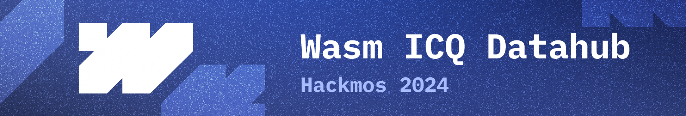
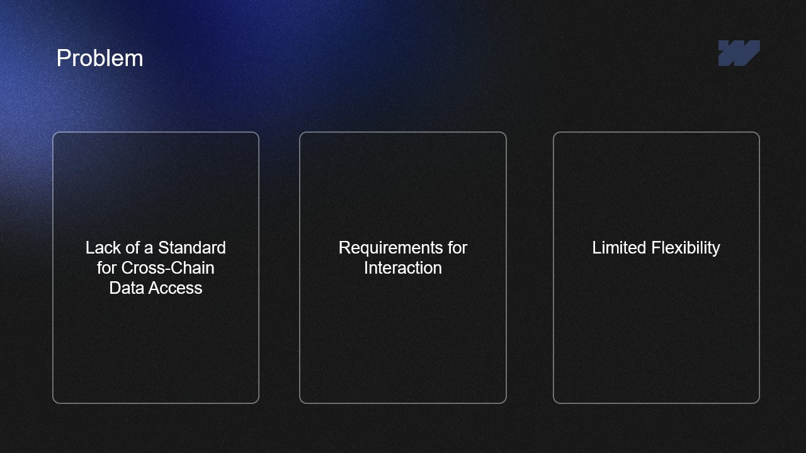
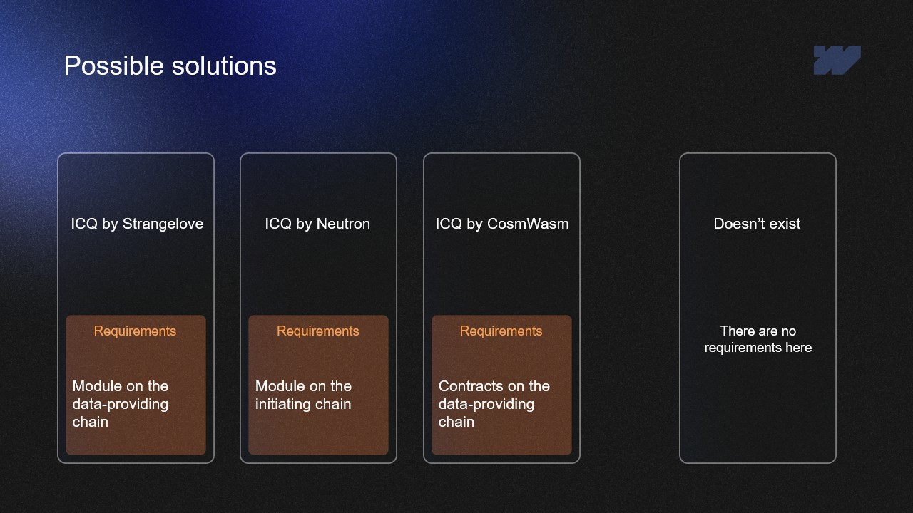
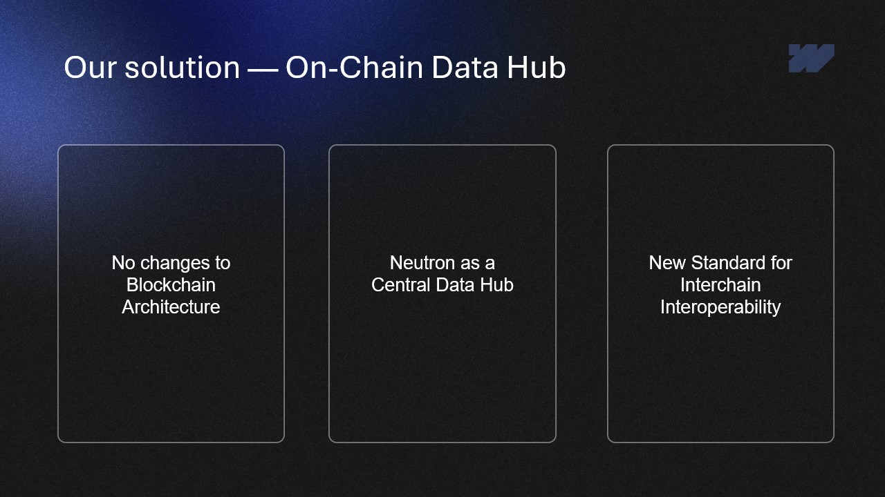
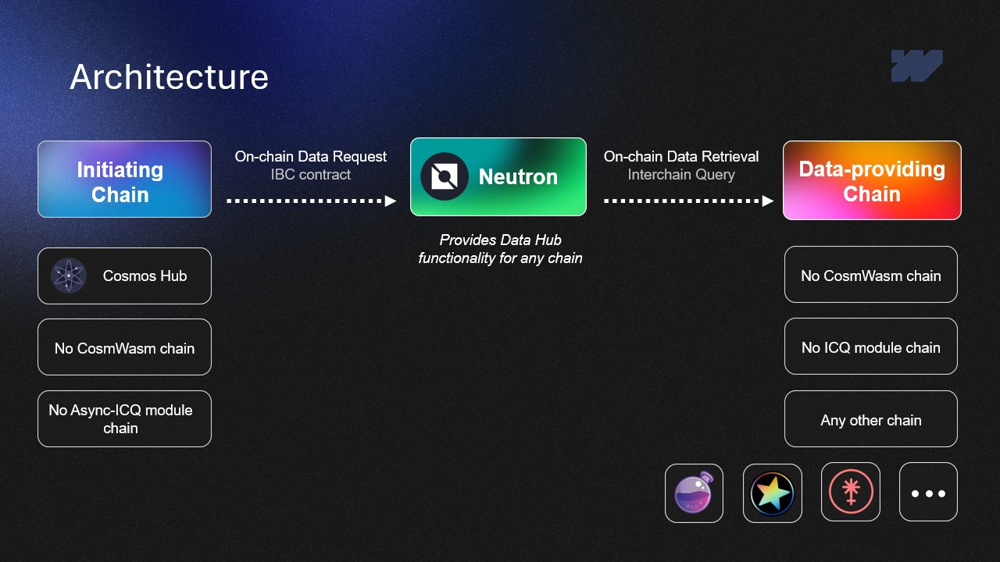
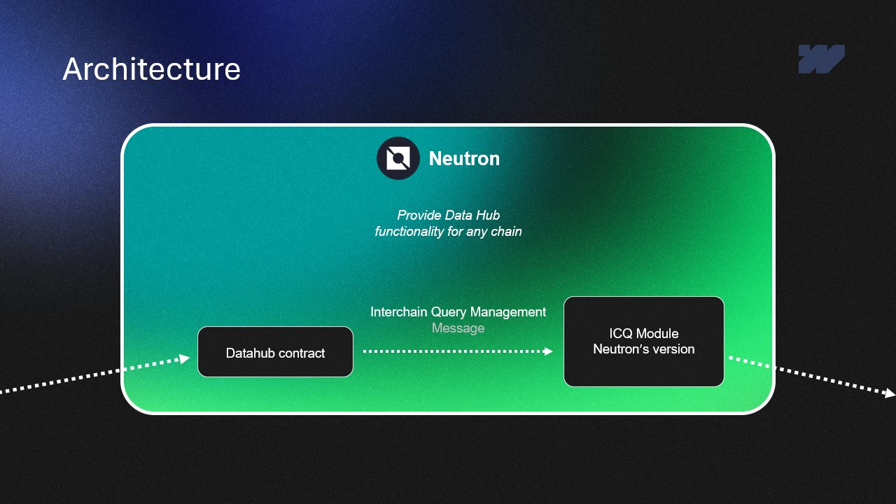
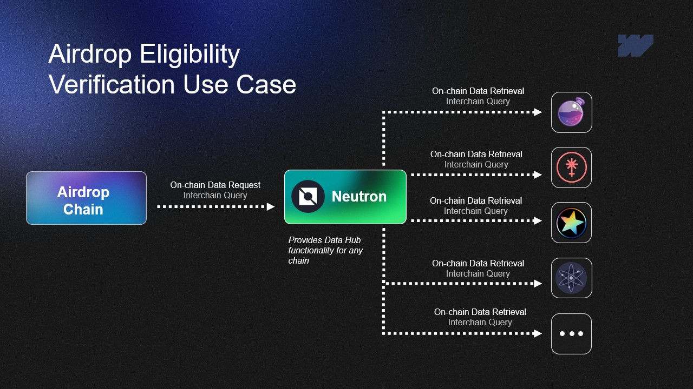
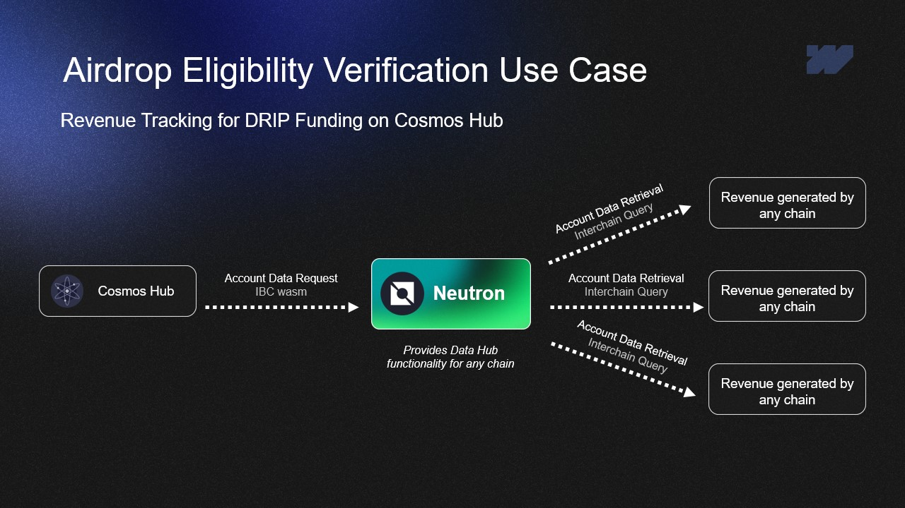

# HACKMOS-2024

We’re excited to introduce our project – On-Chain Data Hub. It’s a solution for seamless and standardized data exchange between blockchains, aimed at removing current barriers to interchain interaction.​

Let’s move on to the problem we’re addressing!

## Content
* [Content](#Content)
* [Problem](#Problem)
* [Possible solutions](#Possible)
* [Our solution — On-Chain Data Hub](#Our)
* [Architecture](#Architecture)
* [Demo](#Demo)
* [Use cases](#Use)
* [Repositories](#Repositories)

## Problem

#### Lack of a Standard for Cross-Chain Data Access
Currently, there is no standardized way for blockchains to retrieve data from other chains without additional modules or  contract integrations.

#### Burdensome Requirements for Interaction
To initiate cross-chain queries, blockchains are often required to add modules, deploy smart contracts, or undergo complex governance processes.

#### Limited Flexibility
Without a simple and unified solution, many blockchains remain isolated, unable to easily exchange data.

## Possible solutions

- Strangelove and Neutron solutions enable interchain queries, but both require modifications to blockchain architecture.
- Strangelove: requires AsyncICQ integration on the data-providing blockchain.
- Neutron: requires a module on the initiating blockchain.
- ICQ Contracts: require a CosmWasm module with permissionless deployment or a passed governance proposal on the data-providing blockchain.
- These methods work well when blockchain architecture modifications are feasible, but they are unsuitable when such changes are undesirable or impossible.

This is where our solution comes into play!

## Our solution — On-Chain Data Hub

- On-Chain Data Hub enables interchain queries without requiring any modifications to the architecture of the involved blockchains
- The solution leverages a smart contract on the Neutron blockchain, which already has an interchain query module
- There’s no need to add modules or contracts to the initiating or data-providing blockchains—the entire process is managed through Neutron

### Architecture

Our Initial Chain sends a query without requiring any modules or CosmWasm. The data is routed through Neutron, which acts as a Data Hub with a contract to manage interchain queries. The query is then directed to the Data Providing Chain, which also requires no additional modules or CosmWasm.

Within Neutron, our Data Hub contract manages interchain queries, interacting with Neutron’s ICQ module to execute and retrieve the data, then returns the requested data back to the Initial Chain.

### Demo

todo

## Use cases

Ideal for financial protocols, analytics platforms, and infrastructures where flexibility and independence from architectural modifications are critical

1. Airdrops Eligibility Verification. Allows a blockchain to verify specific conditions on another chain to ensure a user qualifies for an airdrop, supporting accurate and conditional distribution.

1. Revenue Tracking for DRIP Funding on Cosmos Hub. Enables the collection and tracking of protocol revenues for transparent and automated funding distribution through DRIP on Cosmos Hub.

## Repositories

* [wasm-icq/HACKMOS-2024](https://github.com/wasm-icq/HACKMOS-2024) - Root documentation repository for the Wasm ICQ DataHub project
* [wasm-icq/wasm-icq](https://github.com/wasm-icq/wasm-icq) - CosmWasm contract for DataHub, enabling interaction with Neutron’s ICQ module
* [wasm-icq/wasm-icq-invoker](https://github.com/wasm-icq/wasm-icq-invoker) - Example of initiating DataHub calls from an external chain via CosmWasm contract
